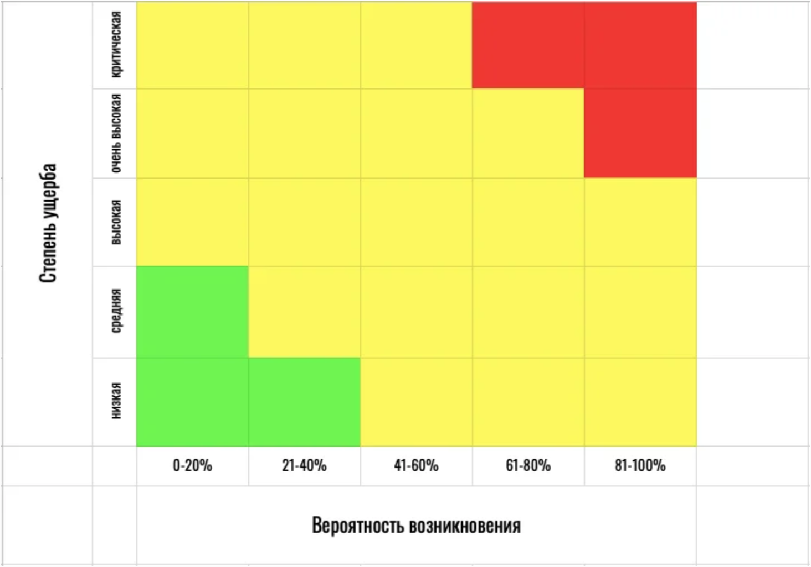

# Проведение тренинга

## Ледоколы, Энергетики и другие интерактивные игры
> Включение интерактивных упражнений в состав учебных занятий может стать мощным учебным инструментом, в то время как все люди учатся по-разному (в дополнение к культурным и региональным различиям), превращение учебных семинаров в увлекательные и интерактивные является эффективным методом обучения для большинства участников.

## Почему интерактивные упражнения?
Это упражнения, которые фасилитаторы и тренеры могут использовать, чтобы побудить участников быть более расслабленными друг с другом, стать (вновь) заряженными энергией и заинтересованными, а также помочь изменить темп дня. Существует 3 основных типа интерактивных упражнений, которые часто используются во время тренингов по цифровой безопасности:

### Ледоколы
Как следует из названия, ледоколы предназначены для того, чтобы «разбить лед», и, как правило, это веселые игры и мероприятия, посвященные знакомству с вами, которые также помогают участникам узнать их сходства и различия в увлекательной игровой форме. 

Участники, которые расслаблены друг с другом и их тренерами, учатся лучше. Когда у вас есть участники, которые менее ограничены и более удобны в тренировочном пространстве, вы можете рассчитывать на обучение с максимальным участием и интерактивностью.

### Антидепрессанты
Тренеры могут помочь изменить темп дня с помощью увлекательных интерактивных сессий под названием Energizers . Энергетики особенно полезны после обеда или длительных периодов сидения, когда групповая энергия часто находится на самом низком уровне и / или участники могут казаться наиболее расстроенными. Энергетики также полезны, когда группе,
включая тренера, просто нужен веселый перерыв от тренировок.

### Тематические интерактивные игры (или занятия)
Более специализированные действия, относящиеся к конкретным темам обучения, называются тематическими интерактивными играми (или упражнениями в [методологии ADIDS](http://www.level-up.cc/before-an-event/levelups-approach-to-adult-learning/)). 

При использовании ADIDS для разработки учебных занятий для взрослых учащихся вам необходимо разработать или использовать уже существующие занятия на основе темы вашего занятия. Затем они приведут к дискуссии об этой конкретной деятельности, которая является одной из главных особенностей, отличающих эту деятельность от ледоколов и энергетиков.

Эти мероприятия могут быть убедительными моментами «А-ха!» Для участников, особенно при использовании хорошо продуманного упражнения для освещения сложных технических концепций или систем. Иногда Ледоколы и Энергизаторы также могут служить этой цели - например, хорошо разработанная Спектрограмма может использоваться в качестве ледокольного упражнения (Чтобы узнать больше, см. Нашу страницу Спектрограммы).

### Что следует учитывать при интерактивных упражнениях
Прежде чем встраивать определенные упражнения в свой план тренировок, выбирать конкретные упражнения на месте во время тренировки или разрабатывать и адаптировать новые упражнения для последующего использования, не забывайте всегда учитывать следующие соображения.

### Мобильность участников
У вас могут быть участники, которые не так мобильны, как остальные. Вам нужно будет выбрать и / или разработать Ледоколы и энергизеры, которые не исключат участия слушателей с проблемами мобильности.

### Культурные различия
Во многих случаях вам придется работать с участниками, которые имеют различное культурное происхождение. Упражнение, которое работает для тренинга с участием всех участников из Индонезии, может быть не идеальным для группы из разных стран из одной страны. Аналогичным образом, деятельность, которая хорошо работала с группой женщин из Западной Европы, может не сработать так хорошо, если вы отнесете ее к другой группе женщин из Латинской Америки.

### Личное и физическое пространство
Старайтесь избегать действий, которые требуют от участников прикосновения друг к другу - из этого есть несколько исключений, но это, как правило, семинары разного рода. Даже если вы прошли несколько дней на тренинге, и участники хорошо сблизились, учтите тот факт, что вы все равно вряд ли узнаете, есть ли участник, который чувствует себя неловко от прикосновения.
(Для получения дополнительной информации см. ресурс [«Психосоциальные основы тренингов по безопасности](http://www.level-up.cc/before-an-event/psychosocial-underpinnings-of-security-training/4-traumatic-stress-reactions/)».

### Языковые барьеры
Особенно на международных или региональных семинарах, не все обязательно будут носителями одного языка. Через доску тренеры должны использовать упражнения, требующие как можно меньше инструкций - это особенно полезно в этом случае. Упражнения с несложными инструкциями могут повторяться на нескольких языках или диалектах, если это необходимо, либо тренером, если они могут, либо путем работы с желающим переводчиком.

### Пример ледоколов для ваших мероприятий
Ледоколы, как следует из названия, предназначены для того, чтобы «сломать лед», и, как правило, это веселые игры и мероприятия, посвященные знакомству с вами. Они помогают участникам лучше познакомиться друг с другом, познакомиться друг с другом и помочь им чувствовать себя комфортно в тренировочном пространстве. Часто инструкторы и инструкторы иллюстрируют первые шаги игры - или, если вы тренируетесь в одиночку, вы можете выбрать работу с желающим участником демонстрации для остальной части группы.

## Две истины и ложь
Цель этой игры состоит в том, чтобы участники узнали друг друга, гадая, являются ли «факты» о других участниках «правдой» или «ложью».

### Инструкции
Попросите участников объединиться в пару с кем-то, кого они не знают, или пусть все встретятся друг с другом по кругу.
* Попросите участников сказать 2 правды о себе и 1 ложь.
* Дайте им несколько минут, чтобы подумать об этом.
* Как только они готовы, все по очереди говорят две правдивые вещи и
одну лгут о себе.

Те, кто не говорит, должны догадаться, какие истины, а какие ложь.

### Примечание тренера
> Групповая версия этого лучше всего работает с меньшим количеством участников (максимум 10 участников) – также могут быть некоторые языковые проблемы. Если у вас есть смешанная группа участников, которые не разбираются в одном языке, вы можете объединить их с таким же участником, который говорит на одном языке – но вы не хотите, чтобы они объединялись с
кем-то, кого они уже знают. Это упражнение также работает для участников, у которых есть проблемы с мобильностью, поскольку это не потребует от них перемещения.

## Что в сумке?
Цель этой игры состоит в том, чтобы участники представились остальным участникам группы, используя личный предмет, который, по их мнению, является «представителем» того, кем они являются как личность.

### Инструкции
Попросите всех пойти посмотреть в свою сумку / рюкзак и найти одну вещь, которая, по их мнению, «представляет» их (оставьте это так, чтобы они могли свободно интерпретировать это по своему усмотрению). - Дайте им время подумать о предметах в их сумках и о том, что они скажут. - Каждый участник по очереди будет описывать себя через пункт, который он выбрал. -
Установите ограничение описания 3 - 5 предложений на человека, чтобы сохранить время.

### Примечание тренера
> Это хорошо для участников, у которых есть проблемы с мобильностью, поскольку это не потребует от них перемещения. Кроме того, здесь предполагается, что все принесли какую-то сумку или какую-то упаковку в тренировочное пространство - проверьте сначала, прежде чем выбрать этот Ледокол!

## Состав в соответствии с...
Цель этой игры состоит в том, чтобы участники расположились в предоставленном пространстве в соответствии с определенными фактами о себе.

### Инструкции
Пусть все встанут в линию или в форме буквы «U», чтобы они могли видеть друг друга - это может быть у стены, если вы выберете. (См. Комментарий о мобильности в разделе «Что нужно учесть выше».) - Подумайте над тем, что вы просите участников рассказать о себе. - Не просите участников раскрывать факты о себе, которые они посчитали бы слишком личными, личными или иным, чем они хотели бы раскрыть. - Примеры основных фактов, которые вы можете использовать: цвет рубашки, размер обуви, сколько времени им
понадобилось, чтобы прийти на тренировку, сколько домашних животных они прожили или рост участников. Участники могут говорить друг с другом во время выполнения упражнения. Имейте в виду, что то, что вы можете считать приемлемым публичным фактом, не всегда одинаково для участников из группы риска, особенно если они не знают и не доверяют всем в комнате.

### Примечание тренера
> Это может не подходить, если у вас есть участники, у которых проблемы с мобильностью; также убедитесь, что у вас достаточно места для этого занятия.

## Чрезмерная реакций!
Цель этой игры - заставить каждого участника чрезмерно реагировать на ситуацию, а остальная часть группы угадать, на какой сценарий реагирует участник.

### Инструкции
Вы должны подготовить сценарии на листах бумаги заранее. Подумайте о ситуациях, которые будут работать для ваших участников. Сценарии могут включать в себя: - Вы только что выиграли в лотерею! - Ты видишь кого-то милого и хочешь с ним встретиться! - Вы только что получили работу своей мечты! - Вы спорите с кем-то по телефону! - Вы собираетесь родить! - Ваши друзья просто устроили вам сюрприз на день рождения! Случайным образом опишите сценарий каждому участнику: - Один из хороших
способов сделать это - положить их в коробку и попросить всех выбрать одну, а затем передать коробку. - Дайте всем время спланировать свои чрезмерные реакции. - Здесь вам необходимо определить, будет ли участникам разрешено выступать или для дополнительного вызова, если им просто придется подражать своей реакции, не издавая ни звука.

Каждый участник по очереди реагирует на свой сценарий, и каждый пытается
угадать.

### Примечание тренера
> Здесь вы должны быть осторожны с культурными ссылками - ваше описание сценария должно соответствовать реалиям ваших участников. Если вы чувствуете, что еще недостаточно знаете о своих участниках, чтобы провести ледокол, сохраните его для второго дня занятий.

## Ветер дует
Цель этой игры - заставить людей, у которых есть общие черты, идентифицировать друг друга, перемещаясь на места друг друга.

### Инструкции
Для этого нужно большое пространство и стулья по кругу. На одного участника должен быть один стул, но для стартера не должно быть стула (в большинстве случаев стартер - это вы, тренер!). - Вы, как стартер, встанете в середине круга и скажете: «Дует ветер для людей, которые…» - Подумайте о том, что вам нравится, или о чем-то, что относится к вам - закончите предложение этим. - Например, если вам нравится клубничное мороженое, вы можете сказать: «Ветер дует для людей, которые ... как клубничное мороженое!» - Каждый, кто любит то же самое (включая вас) или разделяет то же качество, должен будет стоять и переносить мест.

К концу одного раунда один человек останется стоять. Именно этот человек
начнет следующий раунд со слова «Ветер дует людям, которые…».

### Примечание тренера
> Это может не подходить, если у вас есть участники, у которых проблемы с мобильностью; также убедитесь, что у вас достаточно места для этого занятия. Убедитесь, что в вашем учебном помещении нет твердых полов, которые могут привести к скольжению стульев или участников, поскольку это может привести к падению некоторых участников на свободный стул.

## Сеть вопросов
Цель этой игры состоит в том, чтобы участники задавали друг другу вопросы, отслеживая физический объект, который со временем создает сеть связей между людьми в группе.

### Инструкции
Пусть все стоят (или сидят) по кругу - вам понадобится клубок пряжи для этого упражнения. - Стартер направит вопрос конкретному человеку. - для этого они должны бросить клубок пряжи тому человеку, которому они хотят, кому задан
вопрос; но, спрашивающий должен продолжать держать конец пряжи. - После того, как первый человек задал вопрос и бросил шарик пряжи человеку, для которого задан вопрос, респондент должен ответить на вопрос, удерживая шарик пряжи. - Затем они должны задать вопрос другому человеку, бросая ему шар пряжи, удерживая его часть пряжи.

Вышеприведенные шаги повторяются до тех пор, пока не истечет определенный период времени, или пока у всех не будет хотя бы один ход, чтобы ответить и задать вопрос. В конце этой игры у вас будет сеть вопросов и ответов!

### Примечание тренера
> Это будет работать для участников, которые имеют проблемы с мобильностью. Чтобы показать пример вопросов, которые нужно задавать (в частности, чтобы не задавать вопросы, которые считались бы слишком «любопытными»), тренеры или инструктор и желающий участник могут задать первые два вопроса, чтобы проиллюстрировать тип вопросов. спросить. Помните также, что для этого упражнения может потребоваться базовая грамотность на общем языке среди участников.

## Имена и звуки животных
Цель этой игры состоит в том, чтобы дать участникам возможность безопасновыйти за пределы себя и стать более спокойными среди других в группе.

### Инструкции
Пусть все в кругу (стоя или сидя). Каждый человек по очереди произносит свое имя, имя животного с первой буквой имени и звук, связанный с этим животным. (Например, «Я Дана, собака, гав-гав!»). - После того, как первый человек начинает, человеку, стоящему рядом с ним, нужно будет начать с имени предыдущего человека, животного и звука, прежде чем произносить свое имя,
животное и звук. - Например, если следующего человека зовут Чарли, они скажут: «Дана, собака, гав-гав! Я Чарли, кот, мяу… ». - 

Третий после второго человека должен начинаться с имени первого человека, животного и звука, и имя второго человека, животное и звук, прежде чем указывать свое имя животное и звук. - Например, если третьего человека зовут Барбара, он скажет: «Дана, собака, гав! Чарли, кот, мяу… Я Барбара, птица, щебетание».

Шаги, описанные выше, повторяются до тех пор, пока игра снова не достигнет первого лица, которое теперь должно делать все имена, животных и звуки!

### Примечание тренера
> Это особенно хорошо для группы людей, которые действительно не знают друг друга: это отличный способ заставить всех вспомнить имена друг друга. Эта игра также полезна для тренеров, которые хотят создать простой способ запомнить имена участников с самого начала. Если у вас есть участники, у которых есть проблемы с мобильностью, это хорошее упражнение, так как для этого не нужно много двигаться.

## Пример Energizer для ваших мероприятий
Энергетики - это короткие веселые занятия, которые заставляют участников двигаться и взаимодействовать. Это хорошие упражнения для того, чтобы быть готовыми вытащить из своего «инструментария», когда вы чувствуете, что уровень энергии в комнате понижается (например, застекленные глаза.

Зевающие участники, случайный кивок и т. д.). Иногда вашим участникам нужно просто встать со своих мест, потягиваться и / или ходить, чтобы зарядиться энергией. Вы всегда можете вызвать 5-минутных Энерджайзеров, сыграв танцевальную музыку и попросив всех встать и потанцевать. Или растянуть. Или просто сделайте небольшой перерыв, чтобы подышать свежим воздухом из учебного зала.

Если вы используете [Jargon Balls](http://www.level-up.cc/you-the-trainer/be-a-better-trainer/) в своих тренировках, один из самых простых способов активировать комнату - это вызывать случайные бои Jargon Ball, когда все встают и пытаются ударить друг друга Jargon Balls. Вы можете даже побуждать участников произносить жаргон-термины, которые вы использовали ранее на тренинге, когда они делают это, чтобы они могли лучше ознакомиться с этими терминами!

### Примечание тренера
> Вы можете краудсорсинг своих Энерджайзеров, попросив участников вести деятельность. Вы можете сделать это заблаговременно, разместив лист бумаги, размещенный на видном месте в комнате, где участники могут указать свои имена как «Лидеры активистов-добровольцев». Вы также можете сделать это более спонтанно, выбирая участников, которые, кажется, готовы или
заняты на месте. Это хороший способ для вас, как для тренера, учиться у своих участников (и добавлять в свой учебный инструментарий), а также поощрять участие и лидерство ваших участников.

## Удар Джем!
Цель этой игры состоит в том, чтобы участники разработали серию ударов, которые вместе сформируют музыкальный ритм.

### Инструкции
Пусть ваши участники встанут в круг. - Первый человек начинает с одного удара, сделанного дважды. - Это может быть постукивание ногами, хлопание в ладоши, щелчок пальцами или барабанная дробь на столешнице и т. д. - После того, как они закончат свой удар 2 раза, человек справа сделает двойной удар первого человека, а затем добавит еще один удар. - Первый человек продолжит свой ритм, как это произойдет.

После того, как второй человек дважды заканчивает свои 2 удара, третий делает удары первого и второго участников, а затем добавляет свои собственные, снова делая это дважды. Первый и второй человек продолжают свои оригинальные удары. Повторяйте, пока все в группе не по очереди добавят свой ритм, и каждый не создаст музыкальное произведение.

### Примечание тренера
>Это идеально для 10-12 участников (8 работ тоже, но не меньше) - он также может работать с большими группами, если время хорошо организовано. Вы также можете сделать вариацию на Beat Jam, в которой вместо этого используются движения, но оригинальная версия лучше работает для участников, имеющих проблемы с мобильностью.

## За экраном
Цель этой игры - проверить память участников на имена друг друга в тесте скорости.

### Инструкции
Вам понадобится большой лист (или одеяло, или большой кусок мясной бумаги). - Если у вас есть одеяло или лист, убедитесь, что он не полностью непрозрачный. - Вам также понадобятся два помощника, чтобы держать лист в середине пространства. - Разбейте группу на две команды. Попросите каждую команду остаться на противоположных сторонах листа.

У каждой команды будет один человек перед экраном за раунд. Как только экран поднят, первый человек, который назовет представителя другой команды, получает очко.

### Примечание тренера
> Это хорошее упражнение, чтобы участники запомнили имена друг друга.

## Самый эффективный метод
Цель этой игры состоит в том, чтобы каждый мог найти самый быстрый способ получить мяч от первого лица до последнего (чтобы убедиться, что все поймали мяч и получили его). Но, как посредник, старайтесь не разглашать это до тех пор, пока группы не проведут первый раунд.

Инструкции
Вам понадобится маленький резиновый или пластиковый шарик и таймер для этого Energizer. - Пусть все в кругу, и случайным образом раздать мяч участнику. - Этот первый человек бросит мяч другому участнику и так далее, и тому подобное. - Каждый должен обратить внимание на последовательность участников. - Попросите группу снова бросить мяч друг другу, повторяя ту же
последовательность действий, что и раньше. - Тренер должен рассчитывать этот раунд.

Попросите участников попытаться найти способ побить текущее время, сохраняя при этом ту же последовательность. Сделайте еще как минимум 2 раунда для участников, чтобы попытаться побить текущее лучшее время.

### Примечание тренера
>Это может не подходить, если у вас есть участники, у которых проблемы с мобильностью; также убедитесь, что у вас достаточно места для этого занятия.

## Тематические интерактивные игры (или занятия)
Тематические интерактивные игры - это более индивидуальные действия, которые имеют отношение к конкретным темам, на которых сосредоточено обучение. При использовании AdID для того чтобы конструировать ваши занятия для взрослых учеников, иногда вам нужно будет разработать тематическом интерактивных игр (обычно называют деятельности как часть
AdID для), основанных на тему сессии.

Затем они приведут к дискуссии об этой конкретной деятельности, которая является одной из главных особенностей, отличающих эти виды деятельности от ледоколов и энергетиков выше. Некоторые Ледоколы и Энерджайзеры могут также быть адаптированы как Действия на Сессиях ADIDS. Примером этого является широко используемая [активность спектрограммы](http://www.level-up.cc/you-the-trainer/first-3-sessions-of-your-event/sharing-your-story/), которая также является популярным ледоколом.

Смотрите примеры тематических интерактивных игр в качестве упражнений в нашей [учебной программе для тренеров](http://www.level-up.cc/curriculum/) здесь, которые можно найти как элементы «Активность и обсуждение»

### Дополнительные ресурсы
* [Групповые упражнения Aspiration Tech](https://facilitation.aspirationtech.org/index.php?title=Facilitation:Spectrogram_Facilitator_Notes), включая спектрограммы.
* В [KSToolkit Wiki](http://www.kstoolkit.org/KS+Methods) есть целый ряд ледоколов и энгергизеров.
* В [дикой природе](http://wilderdom.com/games/) есть дополнительные базовые ледоколы и энергетики.

## Изучение потребностей
Неотъемлемой и очень важной частью тренинга является анализ рисков, которые участники сами осознают и понимают. Для начала участники перечисляют известные и осознаваемые ими риски, а потом ранжируют их по степени ущерба от проявлений
этих рисков. По результатам составляется «матрица рисков» (пример):

Такого рода анализ на месте позволяет сконцентрироваться именно на потребностях участников, а не представлении тренера о нуждах участников. В результате моделирования — обговорить и уменьшить риски, которые сами назвали участники конкретными советами и помощью. Задача – сконцентрироваться на рисках из красной зоны, менее подробно проработать риски из желтой зоны и только иллюстративно упоминать риски из зеленой зоны.

Этот раздел содержит учебные модули, связанные с безопасными практиками для мобильных устройств, в частности мобильных телефонов. Рассматриваемые темы включают в себя то, как структуры мобильных сетей передают данные, как функционируют технологии мобильных телефонов и стратегии более безопасной связи с использованием мобильных устройств.

## Ресурсы

### Как работают мобильные сети
Этот модуль предназначен для ознакомительного обзора того, как мобильные устройства функционируют с использованием сетей мобильной телефонии. Несмотря на то, что будут обсуждаться некоторые основанные на функциях стратегии и решения для обеспечения безопасности и конфиденциальности, это в значительной степени должно подготовить почву для дальнейшего продвижения к более сложным темам мобильной безопасности. Здесь рассматриваются основы всех мобильных телефонов и устройств, поскольку, когда инструктор проводит тренинг для участников, у которых нет смартфонов, он не рассматривает проблемы и приложения для смартфонов.

Этот раздел содержит учебные модули, связанные с инструментами и методами для обеспечения более безопасной электронной почты, обмена сообщениями и других онлайн-коммуникаций. В настоящее время рассматриваются следующие темы: шифрование сообщений электронной почты с использованием GPG / PGP, функционирование шифрования с открытым / закрытым ключом, а также основы перемещения электронной почты между пользователями по сети.

## Безопасное общение: PGP / GPG шифрование электронной почты
Этот модуль сеанса охватывает шифрование электронной почты с использованием протокола PGP (Pretty Good Privacy) и эквивалентного протокола GPG (Gnu Privacy Guard). PGP / GPG является одним из более сложных инструментов для обучения в средней цифровой технике безопасности, а также наиболее трудоемким. Этот модуль сеанса включает в себя несколько вариантов, из которых тренеры могут выбирать для своих компонентов ADIDS для тренинга по расширенной электронной почте.

## Цели обучения для участников ##
* Понять, как электронная почта отправляется, маршрутизируется и принимается, включая информацию о том, где и как можно прочитать содержимое электронной почты.
* Способы минимизации воздействия нежелательной почты на электронную почту.
* Понять, что такое GPG / PGP, что он делает и чего не делает, включая различные проблемы, связанные с его использованием (например, потенциальное «привлечение внимания» к его использованию, ограничения возможности его использования на мобильных устройствах и т. д.).
* Уметь создавать частную / открытую пару ключей, загружать открытый ключ в цепочку ключей, находить и загружать открытые ключи других, а также проверять подлинность и ключи других.
* Уметь отправлять и получать электронные письма, которые подписаны или зашифрованы с использованием GPG / PGP.
Понять важность обеспечения безопасности вашего закрытого ключа и способы отзыва вашего открытого ключа. 

## Безопасные рабочие пространства - Использование хвостов
Tails (Amnesic Incognito Live System) - это операционная система, работающая в режиме реального времени, или операционная система, которая может запускаться непосредственно с внешнего устройства хранения данных, такого как USB-накопитель или SD-карта. Помимо переносимости, Tails не оставляет никаких следов после отключения от машины и маршрутизирует весь интернет-трафик через сеть Tor.

### Цели обучения для участников
* Понять, как работает интернет-цензура.
* Представьте Tails (Amnesic Incognito Live System), работающую операционную систему, которая может быть загружена на любой компьютер с использованием внешних носителей, таких как USB-накопитель, DVD или SD-карта.
* Научитесь безопасно загружать и устанавливать комплект операционной системы Tails.
* Научитесь использовать хвосты и включенные приложения для задач производительности.
* Понимать концепции анонимности и цифровой безопасности, лежащие в основе дизайна Tails.

### Важные заметки
* Количество стран, где использование шифрования является незаконным и этот закон применяется, уменьшилось, но для некоторых участников это все еще вызывает серьезную обеспокоенность. Перед началом обучения ознакомьтесь с законами, в которых живут и работают ваши участники, а также с законами, в которых вы проводите обучение.
* Как минимум, базовое понимание Tor, технологии, встроенной в Tails, которая обеспечивает зашифрованное анонимное соединение для пользователей, является ключом к использованию и пониманию Tails.
* Модуль «[Безопасный просмотр - анонимность и обход](http://www.level-up.cc/curriculum/safer-browsing/anonymity-and-circumvention/)» с использованиемуглубления пакета [Tor Browser](http://www.level-up.cc/curriculum/safer-browsing/anonymity-and-circumvention/deepening/using-tor/) является предварительным условием для этого модуля и должен быть рассмотрен до перехода *к любому сеансу, который включает использование Tails.

## Ресурсы
### Активность и обсуждение: FW:
Это упражнение поможет проиллюстрировать, какими видами информации участники могут не захотеть делиться в социальных сетях, и их неспособностью контролировать информацию, когда она размещена и используется кем-то еще. Совместно используемая информация может быть изменена другими неконтролируемыми способами, и что те, кто получает информацию, которой вы делитесь, могут быть ненадежными.

### Вход: Основы социальных медиа
Этот входной сеанс охватывает основные компоненты, которые необходимо передать участникам, об использовании социальных сетей и приложений, а также о последствиях обмена личной информацией как с другими пользователями, так и с компаниями, владеющими такими приложениями.

### Осведомленность о безопасности в социальных сетях
Вводный модуль, посвященный основным моментам, касающимся безопасных практик и поведения при использовании приложений и сервисов социальных сетей, с целью повышения осведомленности участников о компромиссах сервисов социальных сетей, что позволяет им делать более осознанный выбор.

### Защита от вредоносных программ
Этот раздел содержит учебные модули, связанные с защитой устройств и данных от вредоносного программного обеспечения (вредоносных программ), а также практические приемы, которые могут использовать участники тренинга для уменьшения воздействия на них. Рассматриваются следующие темы: что такое вредоносное ПО, как устройства могут подвергаться его воздействию, и как снизить риски, связанные с вредоносным ПО.

## Ресурсы
### Безопасное обновление программного обеспечения
В этом модуле базового уровня рассматриваются привычки и методы более безопасной загрузки и обновления программного обеспечения на устройстве. Поскольку этот модуль включает в себя задачи по загрузке и установке программного обеспечения, рекомендуется, чтобы преподаватель до начала урока подтвердил, что веб-сайты, представленные в этих действиях, являются нефильтрованными и подлинными.

### Использование антивирусных инструментов
В этом модуле базового уровня рассматриваются основы того, что представляет собой вредоносное ПО, как пользовательские устройства могут подвергаться его воздействию, а также как снизить риски, связанные с вредоносным ПО, посредством безопасного поведения, базовых действий и осознанного использования антивирусного программного обеспечения.

`Обновлено: 30.04.2019`
